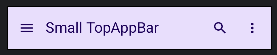
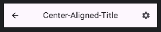
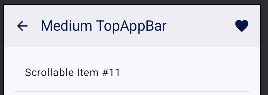
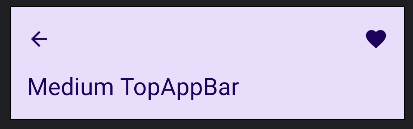
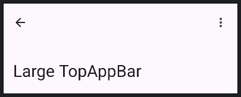
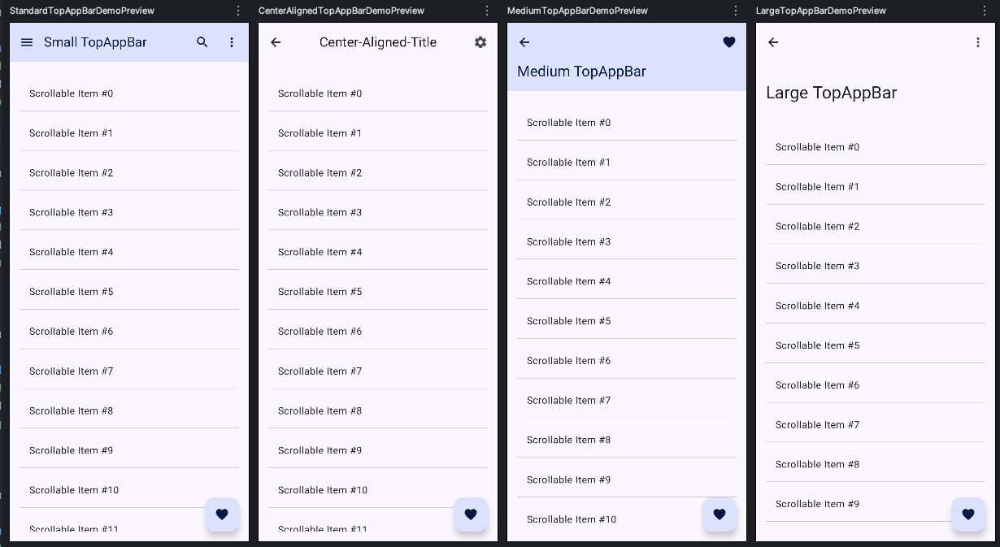

## Components Demonstrated:

1. **Standard TopAppBar Demo:**
    * `Standard TopAppBar` (TopAppBar)`

```kotlin

// 1. Small TopAppBar (default type)
@OptIn(ExperimentalMaterial3Api::class) // Needed for TopAppBar and its scrollBehavior
@Composable
fun StandardTopAppBarContent(
   navController: NavController,
   context: android.content.Context,
   scrollBehavior: TopAppBarScrollBehavior? // Nullable if the bar should not react to scroll
) {
   // `TopAppBar` is the standard, small top app bar.
   TopAppBar(
      title = {
         Text(
            "Small TopAppBar",
            maxLines = 1, // Ensure title doesn't wrap to multiple lines unexpectedly.
            overflow = TextOverflow.Ellipsis // Add ellipsis if title is too long.
         )
      },
      navigationIcon = { // Icon at the start of the TopAppBar.
         if (navController.previousBackStackEntry != null) {
            // Standard back button pattern.
            IconButton(onClick = { navController.navigateUp() }) {
               Icon(
                  imageVector = Icons.AutoMirrored.Filled.ArrowBack,
                  contentDescription = "Back"
               )
            }
         } else {
            // Example: Menu icon if no back navigation is possible.
            IconButton(onClick = { Toast.makeText(context, "Menu Clicked!", Toast.LENGTH_SHORT).show() }) {
               Icon(
                  imageVector = Icons.Filled.Menu,
                  contentDescription = "Menu"
               )
            }
         }
      },
      actions = { // Composable slot for action items at the end of the TopAppBar.
         IconButton(onClick = { Toast.makeText(context, "Search Clicked!", Toast.LENGTH_SHORT).show() }) {
            Icon(
               imageVector = Icons.Filled.Search,
               contentDescription = "Search"
            )
         }
         OverflowMenuDemo(context) // Example of an overflow menu.
      },
      scrollBehavior = scrollBehavior, // Connects the TopAppBar's appearance to scroll events.
      // `colors` can be used to customize background, title, and icon colors.
      colors = TopAppBarDefaults.topAppBarColors(
         containerColor = MaterialTheme.colorScheme.primaryContainer,
         titleContentColor = MaterialTheme.colorScheme.onPrimaryContainer,
         navigationIconContentColor = MaterialTheme.colorScheme.onPrimaryContainer,
         actionIconContentColor = MaterialTheme.colorScheme.onPrimaryContainer
      )
   )
}

```



-----

2. **CenterAlignedTopAppBar Demo:**
* `CenterAlignedTopAppBar ` (CenterAlignedTopAppBar)`

```kotlin

@Composable
fun CenterAlignedTopAppBarContent(
   navController: NavController,
   context: android.content.Context,
   scrollBehavior: TopAppBarScrollBehavior?
) {
   // `CenterAlignedTopAppBar` places the title in the center of the app bar.
   CenterAlignedTopAppBar(
      title = { Text("Center-Aligned-Title") },
      navigationIcon = {
         IconButton(onClick = { navController.navigateUp() }) { // Assuming back navigation for simplicity
            Icon(Icons.AutoMirrored.Filled.ArrowBack, "Back")
         }
      },
      actions = {
         IconButton(onClick = { Toast.makeText(context, "Settings Clicked!", Toast.LENGTH_SHORT).show() }) {
            Icon(Icons.Filled.Settings, "Settings")
         }
      },
      scrollBehavior = scrollBehavior
      // Custom colors can be applied here too using TopAppBarDefaults.centerAlignedTopAppBarColors()
   )
}

```


-----

3. **MediumTopAppBar Demo:**
* `MediumTopAppBar ` (MediumTopAppBar)`

```kotlin
@Composable
fun MediumTopAppBarContent(
   navController: NavController,
   context: android.content.Context,
   scrollBehavior: TopAppBarScrollBehavior // Scroll behavior is typically required for Medium/Large.
) {
   // `MediumTopAppBar` has a larger collapsed height and expands further when content is scrolled up.
   // It requires a `scrollBehavior` to work correctly.
   MediumTopAppBar(
      title = { Text("Medium TopAppBar") },
      navigationIcon = {
         IconButton(onClick = { navController.navigateUp() }) {
            Icon(Icons.AutoMirrored.Filled.ArrowBack, "Back")
         }
      },
      actions = {
         IconButton(onClick = {
            Toast.makeText(context, "Favorite Clicked!", Toast.LENGTH_SHORT).show()
         }) {
            Icon(Icons.Filled.Favorite, "Favorite")
         }
      },
      scrollBehavior = scrollBehavior,// This makes the app bar react to scrolling.
      // `colors` can be used to customize background, title, and icon colors.
      colors = TopAppBarDefaults.topAppBarColors(
         containerColor = MaterialTheme.colorScheme.primaryContainer,
         titleContentColor = MaterialTheme.colorScheme.onPrimaryContainer,
         navigationIconContentColor = MaterialTheme.colorScheme.onPrimaryContainer,
         actionIconContentColor = MaterialTheme.colorScheme.onPrimaryContainer
      )
   )
}

```



-----

4. **LargeTopAppBar Demo:**
* `LargeTopAppBar ` (LargeTopAppBar)`

```kotlin

@Composable
fun LargeTopAppBarContent(
   navController: NavController,
   context: Context,
   scrollBehavior: TopAppBarScrollBehavior // Scroll behavior is typically required for Medium/Large.
) {
   // `MediumTopAppBar` has a larger collapsed height and expands further when content is scrolled up.
   // It requires a `scrollBehavior` to work correctly.
   LargeTopAppBar(
      title = { Text("Large TopAppBar", maxLines = 2, overflow = TextOverflow.Ellipsis) },
      navigationIcon = {
         IconButton(onClick = {navController.navigateUp()}) {
            Icon(Icons.AutoMirrored.Filled.ArrowBack, "Back")
         }
      },
      actions = {
         OverflowMenuDemo(context)

      },
      scrollBehavior = scrollBehavior// This makes the app bar react to scrolling.
   )
}

```


-----

* `Helper composable for a simple Overflow Menu in TopAppBar actions.`
```kotlin

@Composable
fun OverflowMenuDemo(context: android.content.Context) {
   // State to control the visibility of the DropdownMenu.
   var showMenu by remember { mutableStateOf(false) }

   Box { // Box is used to anchor the DropdownMenu to the IconButton.
      IconButton(onClick = { showMenu = !showMenu }) {
         Icon(
            imageVector = Icons.Filled.MoreVert,
            contentDescription = "More options"
         )
      }
      // `DropdownMenu` provides a list of options that appears when `showMenu` is true.
      DropdownMenu(
         expanded = showMenu,
         onDismissRequest = { showMenu = false } // Called when the menu should be dismissed (e.g., click outside).
      ) {
         // `DropdownMenuItem` represents a single item in the menu.
         DropdownMenuItem(
            text = { Text("Option 1") },
            onClick = {
               Toast.makeText(context, "Option 1 Selected", Toast.LENGTH_SHORT).show()
               showMenu = false // Dismiss the menu after selection.
            }
         )
         DropdownMenuItem(
            text = { Text("Option 2") },
            onClick = {
               Toast.makeText(context, "Option 2 Selected", Toast.LENGTH_SHORT).show()
               showMenu = false
            }
         )
         HorizontalDivider() // Visually separates menu items.
         DropdownMenuItem(
            text = { Text("About") },
            onClick = {
               Toast.makeText(context, "About Clicked", Toast.LENGTH_SHORT).show()
               showMenu = false
            }
         )
      }
   }
}


```

