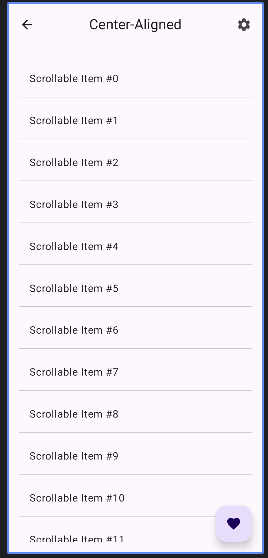

## Components Demonstrated:

1. **CenterAlignedTopAppBar Demo:**
    * `CenterAlignedTopAppBar ` (CenterAlignedTopAppBar)`

```kotlin
@OptIn(ExperimentalMaterial3Api::class)
@Composable
fun CenterAlignedTopAppBarDemo(
    navController: NavController,
    context: android.content.Context,
    scrollBehavior: TopAppBarScrollBehavior?
) {
    // `CenterAlignedTopAppBar` places the title in the center of the app bar.
    CenterAlignedTopAppBar(
        title = { Text("Center-Aligned") },
        navigationIcon = {
            IconButton(onClick = { navController.navigateUp() }) { // Assuming back navigation for simplicity
                Icon(Icons.AutoMirrored.Filled.ArrowBack, "Back")
            }
        },
        actions = {
            IconButton(onClick = { Toast.makeText(context, "Settings Clicked!", Toast.LENGTH_SHORT).show() }) {
                Icon(Icons.Filled.Settings, "Settings")
            }
        },
        scrollBehavior = scrollBehavior
        // Custom colors can be applied here too using TopAppBarDefaults.centerAlignedTopAppBarColors()
    )
}
```



-----